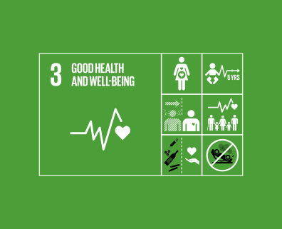
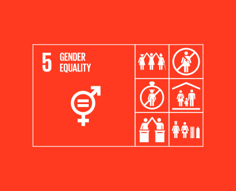

# MERA ANSH

## Index

1. [Why MeraAnsh](#why-meraansh)
2. [About MeraAnsh](#about-meraansh)
3. [Features](#features)
4. [Tech](#tech)
5. [Future Aspects](#future-aspects)

## Why MeraAnsh

***A snapshot of incredible delight is the thing that a mother feels when an infant is put on her arms – a delight each mother ought to reserve the option to encounter. Be that as it may, for some pregnant ladies in India this memory won't ever become, the snapshot of birth is often alarming.*** 

Maternal mortality is viewed as a key wellbeing marker and the immediate reasons for maternal passings are notable and to a great extent preventable and treatable. 

All ladies need admittance to antenatal consideration in pregnancy, skilled care during labor, and support and backing in the weeks after labor. All births ought to be assissted by skilled health experts, as convenient administration and treatment can have the effect among life and passing for both the mother and the child.

## About MeraAnsh

Keeping the problems stated above in mind.
We propose a solution under  
-SDG 3 ***Good health and well-being***  

-SDG 5 ***Achieve gender equality and empower all women and girls***  

**MeraAnsh is a platform that bridges the gap between doctors and users who want to commence or are a part of the beautiful excursion of parenthood.**

## Features

## Tech

- Html
- CSS
- JavaScript
- jQuery
- Bootstrap
- Django

## Future Aspects
